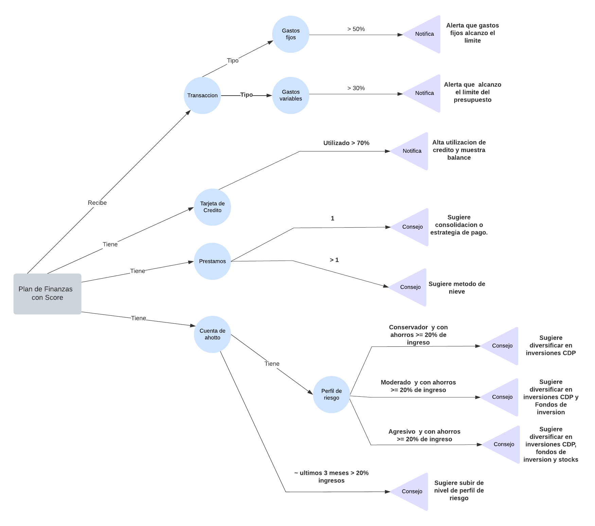

# 📊 Asesor Financiero Inteligente Personal
## Estudiantes
- Alberto Espinoza González
- Denis Andres Solano Monge
- Luis Gabriel Masis Fernandez
- Carlos Alfredo Carranza Hidalgo

## Repositorio:
- [Asesor-Financiero-Inteligente-Personal](https://github.com/ccarranzah/Asesor-Financiero-Inteligente-Personal)

## 📌 Descripción
El **Asesor Financiero Inteligente Personal** es un sistema basado en conocimiento diseñado para ayudar a los usuarios a gestionar sus **ingresos, gastos, deudas e inversiones** de manera eficiente. Utiliza reglas financieras, aprendizaje basado en casos y algoritmos de optimización para proporcionar **recomendaciones personalizadas** y alertas en tiempo real.

## 🎯 Objetivo
Brindar asesoramiento financiero inteligente basado en la **situación económica personal** del usuario, ayudando a mejorar la planificación financiera y la toma de decisiones.

## ⚙️ Componentes del Sistema
- **Base de Reglas**: Define estrategias para gestión de ingresos, gastos, deudas e inversiones.
- **Base de Hechos**: Almacena datos financieros del usuario, incluyendo historial de transacciones.
- **Motor de Inferencia**: Aplica reglas y lógica financiera para generar recomendaciones.

## 🛠️ Tecnologías Utilizadas
- **Backend**: `.NET Core 9` con **C#**
- **Base de Datos**: `SQLite`
- **Lógica de Inferencia**: `NRules (First Order Logic - FOL)`

## 🚀 Funcionalidades Clave
✅ Análisis automático de ingresos y gastos  
✅ Recomendaciones personalizadas para ahorro e inversión  
✅ Alertas financieras en tiempo real  
✅ Optimización del pago de deudas  
✅ Visualización de datos financieros 

## 📂 Instalación y Ejecución
Si no tienes experiencia en programación, sigue estos pasos detallados para instalar y ejecutar el proyecto correctamente en tu computadora. Puede saltar al paso 3 para correr utilizando un contenedor.

### 🖥️ Requisitos previos
Antes de empezar, asegúrate de tener instalado en tu computadora:
1. [**Git**](https://git-scm.com/downloads): Necesario para descargar el código del repositorio.
2. [**.NET SDK**](https://dotnet.microsoft.com/en-us/download): Necesario para ejecutar la aplicación.

Para verificar si están instalados:
- Abre la terminal o consola de comandos:
  - **Windows**: Presiona `Win + R`, escribe `cmd` y presiona `Enter`.
  - **Mac/Linux**: Abre la terminal (`Terminal` en Mac o `Ctrl + Alt + T` en Linux).
- Escribe los siguientes comandos y presiona `Enter`:
  ```bash
  git --version
  dotnet --version
  ```
  - Si ves un número de versión, significa que están instalados.
### 📥 Paso 1: Descargar el proyecto
1. Abre la terminal o línea de comandos.
2. Escribe el siguiente comando para descargar el código del repositorio:
   ```bash
   git clone https://github.com/ccarranzah/Asesor-Financiero-Inteligente-Personal.git
   ```
3. Ingresa a la carpeta del proyecto:
   ```bash
   cd .\Asesor-Financiero-Inteligente-Personal\
   ```

### ⚙️ Paso 2: Ejecutar el proyecto con Docker
Si tienes Docker instalado, puedes ejecutar el proyecto sin necesidad de instalar .NET SDK. Simplemente usa el siguiente comando:
```bash
   docker-compose up
```
Esto descargará las imágenes necesarias, construirá el contenedor y ejecutará el sistema automáticamente montando un Volumen para persistir la base de datos, y crear el port binding. Abrir el navegador en http://localhost:8080

### ▶️ Alternativa: Ejecutar el proyecto manualmente
Si prefieres no usar Docker, asegúrate de tener .NET SDK instalado y sigue estos pasos:

1. Ingresa a la carpeta de la aplicación:
   ```bash
   cd .\src\SmartFinanceAI\SmartFinanceAI.Blazor
   ```
2. Instala las dependencias necesarias ejecutando:
   ```bash
   dotnet restore
   ```
3. Inicia el sistema con:
   ```bash
   dotnet run
   ```

Después de unos segundos, el sistema estará funcionando y mostrará información en la consola.

### 🔄 Paso 4: Interactuar con el sistema
- Dependiendo de la configuración, puedes ver resultados directamente en la terminal o en una interfaz web si el proyecto la incluye.
- Sigue las instrucciones en pantalla para probar sus funcionalidades.
## 🛠️ Desarrollo y Colaboración
Si deseas contribuir, revisa el archivo **[CONTRIBUTING](CONTRIBUTING.md)** para pautas de desarrollo. Cualquier sugerencia o mejora es bienvenida 🚀.

## 📄 Licencia
Este proyecto está bajo la Licencia MIT. Consulta el archivo [LICENSE](LICENSE) para más detalles.

## Diagrama de Conocimiento



## 📌 Casos de Uso y Ejemplos

### Caso de Uso 1: Notificación de Umbral

#### Objetivo
Alertar al usuario cuando, al registrar una transacción, esté próximo a superar (o efectivamente supere) el umbral asignado a cada segmento de la regla 50/30/20:
- 50% de gastos esenciales o necesidades (alquiler, servicios, seguros, etc.),
- 30% de gastos variables o estilo de vida (entretenimiento, ocio, compras, etc.),
- 20% de ahorro/inversión.

El sistema monitorea las transacciones ingresadas y, en el momento de registrar un gasto, determina si el nuevo monto acumulado en alguna categoría se encuentra cerca de su límite o lo excede.

#### Actores
- **Usuario (Actor Principal)**:
  - Registra sus transacciones (ingresos, gastos).
  - Puede recibir notificaciones o alertas.
- **Sistema de Asesor Financiero Inteligente**:
  - Procesa las transacciones en tiempo real.
  - Determina si se está cerca o se ha sobrepasado un umbral de la regla 50/30/20.
  - Envía la notificación correspondiente al usuario.

#### Descripción
1. El usuario ingresa una nueva transacción (por ejemplo, un gasto en la categoría de gastos variables).
2. El sistema acumula el gasto en la categoría correspondiente (en este caso, “estilo de vida” o “variables”).
3. Con base en la suma total de cada categoría y el ingreso mensual establecido, el sistema calcula el porcentaje actual.
4. Si se detecta que la categoría alcanza o está a punto de superar el porcentaje límite (50% en necesidades, 30% en estilo de vida, o 20% en ahorro/inversión), se dispara una alerta.
5. El usuario recibe una notificación (correo, SMS, push notification, etc.) indicando el estatus y la recomendación correspondiente.

#### Precondiciones
- El usuario ya ha configurado sus ingresos mensuales y categorías de gasto, asignándolas de acuerdo con la regla 50/30/20.
- El sistema mantiene un registro detallado de transacciones categorizadas (necesidades, estilo de vida, ahorro/inversión).
- El usuario cuenta con acceso al sistema para registrar sus transacciones (app, web, etc.).

#### Flujo Principal

**Ingreso de Transacción**  
1. El usuario introduce una nueva transacción, indicando:  
   - Monto  
   - Categoría (p.ej., necesidades, estilo de vida o ahorro)  
   - Fecha y descripción, si aplica.

**Actualización de Saldos y Cálculo de Porcentajes**  
1. El sistema toma la nueva transacción y actualiza el total acumulado en la categoría correspondiente.  
2. Recalcula el porcentaje invertido en cada segmento (necesidades, estilo de vida y ahorro) respecto al ingreso mensual.

**Verificación de Umbrales**  
1. El sistema compara los porcentajes actuales con los límites establecidos por la regla 50/30/20.  
   - **Necesidades**: Se ha llegado o se está a punto de llegar al 50% de los ingresos destinados a esta categoría.  
   - **Estilo de Vida**: Se ha llegado o se está a punto de llegar al 30% de los ingresos.  
   - **Ahorro**: Se verifica si se mantiene o se supera el 20% (o si no se está alcanzando).

**Generación de Alerta**  
1. Si alguno de los límites se excede o está cercano a superarse (por ejemplo, sobrepasar el 90% del 30% para estilo de vida), el sistema genera una notificación de alerta o recomendación.  
2. La notificación incluye el detalle del porcentaje alcanzado y posibles consejos para no sobrepasar el límite o para ajustarse a la meta de ahorro/inversión.

**Notificación al Usuario**  
1. El sistema envía la alerta por el canal configurado (correo, app móvil, SMS, etc.).  
2. El usuario puede ver el detalle y decidir tomar acción (recortar gastos, transferir presupuesto de otra categoría, etc.).

**Fin del Caso de Uso**  
El proceso termina una vez que el sistema ha notificado al usuario y la transacción queda registrada.

#### Regla de Notificación Basada en Umbrales (50/30/20)

**Condición**:
- Se registra una nueva transacción.
- Se recalcula el porcentaje actual para cada categoría (necesidades, estilo de vida, ahorro).
- El nuevo porcentaje está próximo a exceder (ej., > 90% del límite) o ha sobrepasado el límite de la categoría correspondiente.

**Acción (Then)**:
- Enviar notificación al usuario con:
  - Mensaje de alerta (p.ej., “Estás cerca de exceder el 30% destinado al estilo de vida”).
  - Recomendaciones concretas (por ejemplo, revisar gastos en la categoría afectada o equilibrar con otra categoría).
- Registrar el evento en la bitácora del sistema para consultas futuras (p.ej., reporte mensual de alertas).

Esta regla hace uso de la base de hechos, donde se encuentran las transacciones categorizadas y los ingresos mensuales del usuario.

#### Ejemplo de Aplicación
**Ejemplo**: El usuario “Juan” tiene un ingreso mensual de $3,000. Según la regla 50/30/20:  
- 50% (Necesidades): Hasta $1,500  
- 30% (Estilo de Vida): Hasta $900  
- 20% (Ahorro/Inversión): Al menos $600  

Juan ya ha gastado $800 en necesidades y $500 en estilo de vida durante el mes.  
Registra una nueva compra (transacción) de $400 también en estilo de vida (por ejemplo, ropa y ocio).  

- Al recalcular:  
  - Estilo de vida ahora totaliza $900 ($500 + $400).  
  - El sistema ve que con $900, Juan ha llegado justo al 30% de sus ingresos ($900 / $3,000 = 30%).  

**Notificación de Umbral**:  
El sistema genera una alerta:  
“Juan, has alcanzado el 30% asignado a gastos de estilo de vida. Te recomendamos revisar tu presupuesto para no exceder tu meta mensual y mantener intacto tu 20% de ahorro”.

Si Juan intenta hacer otra compra en estilo de vida por $100 más, el sistema alertará que se superó la meta y que ello afectaría su capacidad de ahorro.

---

### Caso de Uso 2: Recomendación de Inversión según Perfil de Riesgo y Superávit (Ahorro)

#### Recomendación de inversión basada en análisis del último mes

**Actores**:
- **Sistema de Asesor Financiero Inteligente** (quien atiende el proceso).
- **Usuario** (El actor principal que consulta y recibe la notificación de inversión).

#### Descripción
El actor consulta al sistema sobre las posibles acciones a realizar en caso de contar con un superávit. El sistema analiza los registros financieros del último mes para determinar si el usuario mantiene un superávit igual o superior al 20% de sus ingresos netos. Si se cumple esta condición, el sistema recomienda una inversión específica considerando el perfil de riesgo del usuario:
- Conservador: Certificados de Depósito a Plazo (CDP)
- Medio: Fondos de Inversión de riesgo moderado
- Agresivo: Fondos más volátiles o inversión en la Bolsa de Valores

#### Precondiciones
- El usuario ha suministrado datos de ingresos, gastos y obligaciones durante el último mes.
- El perfil de riesgo del usuario está definido inicialmente como conservador, medio o agresivo.
- El sistema cuenta con la regla 50/30/20 configurada (o, al menos, el umbral de 20% como referencia para la inversión).

#### Flujo Principal

1. **Consulta del actor**:  
   El actor solicita al sistema las posibles acciones a realizar con el excedente financiero del último estado mensual.

2. **Cálculo del Superávit**:  
   Se determina el porcentaje de superávit y se verifica si es ≥ 20% de los ingresos mensuales.  

   $$
   S = \frac{(I - G)}{I} \times 100\% 
   $$

   Donde:  
   - \( S \): Superávit mensual (resultado de ingresos menos gastos y obligaciones)  
   - \( I \): Ingresos mensuales
   - \( G \): Gastos mensuales (Gastos fijos, variables y obligaciones financieras)

3. **Verificación de Condición**:  
   - Si superávit ≥ 20%: proceder a la recomendación de inversión.  
   - Si superávit < 20%: no se genera una recomendación de inversión (podría darse otro tipo de alerta o consejo, pero eso corresponde a otro caso de uso).

4. **Determinación de la Recomendación**:  
   - El sistema consulta el perfil de riesgo del usuario:  
     - **Conservador**: se recomienda CDP (certificado de depósito a plazo).  
     - **Medio**: se recomienda un Fondo de Inversión de riesgo moderado.  
     - **Agresivo**: se recomienda un Fondo de mayor volatilidad o invertir directamente en la Bolsa de Valores.  
   - El sistema sugiere un monto (p. ej., una parte del superávit) o el porcentaje que se considera oportuno.

5. **Notificación al Usuario**:  
   - Se envía una alerta por el medio configurado (ejemplo: correo, app móvil, SMS, etc.) con la recomendación de inversión y la justificación (superávit ≥ 20%).

**Fin del Caso de Uso.**

#### Regla de Inversión Basada en Superávit y Perfil de Riesgo

**Condición**:
- El superávit del usuario es ≥ 20% de los ingresos mensuales.

**Acción (Then)**:
1. Consultar el perfil de riesgo del usuario.  
2. Recomendar la inversión adecuada:  
   - Conservador → CDP  
   - Medio → Fondo de Inversión (riesgo medio)  
   - Agresivo → Fondo de mayor volatilidad o Bolsa de Valores  

Esta regla se apoya en la base de hechos para conocer el perfil de riesgo y la situación financiera actual.

#### Ejemplos del caso

Los datos que se describen a continuación son meramente ilustrativos y demuestran cómo se aplicarían los casos.

**Supongamos que tenemos los siguientes datos financieros de “Juan”:**  
- ID Usuario: 1023  
- Ingresos Mensuales: $3,000  
- Gastos Fijos: $1,500  
- Gastos Variables: $800  
- Obligaciones Financieras: $400 (por ejemplo, préstamos, tarjetas)

**Cálculo del Superávit**:
$$
S = \frac{(3000 - 1500 - 800 - 400)}{3000} \times 100\% = \frac{300}{3000} \times 100\% = 10\%
$$

- Resultado:  
  - Como el superávit es del 10% y no alcanza el 20%, el sistema NO genera una recomendación de inversión para Juan.  
  - Si Juan hubiera tenido un superávit ≥ 20%, la recomendación variaría según su perfil de riesgo.

##### Ejemplo 1: Juan con Perfil Conservador y Superávit del 20%
Supongamos que Juan ha reducido sus gastos variables en $300, lo que incrementa su superávit a $600, alcanzando el 20% de sus ingresos.

Nuevos cálculos:
$$
S = \frac{(3000 - 1500 - 500 - 400)}{3000} \times 100\% = \frac{600}{3000} \times 100\% = 20\%
$$

**Recomendación del Sistema**  
> **Sugerencia de Inversión**  
> "Juan, hemos analizado tus finanzas y detectamos que tienes un superávit del 20% de tus ingresos.  
> Como tu perfil de riesgo es Conservador, te recomendamos destinar una parte de este excedente, por ejemplo, $400, a un Certificado de Depósito a Plazo (CDP) con un plazo de 6 meses.  
> Esta opción te garantiza estabilidad con una tasa de interés fija y sin riesgos. ¿Te gustaría conocer más detalles?"

##### Ejemplo 2: Juan con Perfil Medio y Superávit del 20%
Si Juan cambia su perfil de Conservador a Medio, el sistema le recomendaría una inversión con mayor rendimiento.

> **Sugerencia de Inversión**  
> "Juan, tu análisis financiero muestra un superávit del 20% de tus ingresos.  
> Como tu perfil de riesgo es Medio, te sugerimos invertir $400 en un Fondo de Inversión de riesgo moderado.  
> Este tipo de fondo combina bonos y acciones para equilibrar seguridad y rendimiento, con mejores ganancias que un CDP.  
> ¿Deseas conocer más sobre esta inversión?"

##### Ejemplo 3: Juan con Perfil Agresivo y Superávit del 20%
Si Juan tiene un perfil de riesgo Agresivo, la recomendación cambiará a inversiones más volátiles, con mayor posibilidad de rendimiento, pero también mayor riesgo.

> **Sugerencia de Inversión**  
> "Juan, felicitaciones, tienes un superávit del 20% de tus ingresos.  
> Como tu perfil de riesgo es Agresivo, te recomendamos explorar la inversión en Fondos de Inversión de alta volatilidad o en la Bolsa de Valores.  
> Estas opciones pueden ofrecerte mayores rendimientos, aunque con un riesgo más elevado.  
> Si te interesa, podemos analizar en qué sector o empresa sería más adecuado invertir. ¿Te gustaría más información?"

---

### Caso de Uso 3: Generación de Reporte Financiero Trimestral con Calificación de Manejo de Finanzas

#### Objetivo
Cada tres meses, el sistema analiza los ingresos, gastos y ahorros del usuario para generar un reporte financiero con una calificación de desempeño financiero. Este informe permite al usuario evaluar si su gestión del dinero ha sido saludable, estable o riesgosa y recibir recomendaciones para mejorar.

#### Actores
- **Usuario (Actor Principal)**:
  - Registra sus transacciones (ingresos, gastos, ahorros).
  - Recibe un reporte trimestral con una evaluación de su manejo financiero.
- **Sistema de Asesor Financiero Inteligente**:
  - Analiza los patrones financieros de los últimos 3 meses.
  - Calcula una calificación basada en métricas clave (ahorro, gasto, inversión, etc.).
  - Genera un informe detallado con recomendaciones para mejorar la gestión financiera.

#### Descripción
1. Cada tres meses, el sistema revisa las transacciones del usuario y calcula su desempeño financiero.  
2. Se comparan los datos con la regla 50/30/20 para evaluar si el usuario ha cumplido con una distribución saludable de su dinero.  
3. Se genera una calificación financiera basada en el cumplimiento de las reglas y el nivel de ahorro.  
4. El sistema genera un informe detallado con:
   - Análisis de ingresos y gastos del trimestre.
   - Cumplimiento de la regla 50/30/20.
   - Comparación con trimestres anteriores.
   - Recomendaciones personalizadas para mejorar la estabilidad financiera.
5. Se envía el informe al usuario con gráficos.

#### Precondiciones
- El usuario ha registrado ingresos, gastos y ahorros durante al menos 3 meses.
- El sistema tiene acceso a las transacciones categorizadas del usuario.
- Se han definido criterios para evaluar la calificación financiera del usuario.

#### Flujo Principal
1. **Revisión de Datos Financieros**:  
   Se recopilan los ingresos, gastos y ahorros del usuario en los últimos tres meses.
2. **Análisis de Cumplimiento de la Regla 50/30/20**:  
   Se calcula qué porcentaje del ingreso se ha destinado a necesidades (50%), gastos variables (30%) y ahorro/inversión (20%).
3. **Asignación de Calificación Financiera**:  
   Se genera una puntuación basada en:  
   - Cumplimiento del ahorro del 20%.  
   - Equilibrio entre necesidades y gastos variables.  
   - Tendencias en la reducción o aumento de deudas.
4. **Generación de Reporte Financiero**:  
   Se elabora un informe con gráficas, alertas y recomendaciones.
5. **Envío del Reporte al Usuario**:  
   Se notifica al usuario y se le permite visualizarlo en la aplicación.

**Fin del Caso de Uso.**

#### Regla de Evaluación Financiera Trimestral

**Condición**:
- Se han registrado datos financieros durante 3 meses.
- Se calculan los promedios de ingresos, gastos y ahorros en ese periodo.

**Acción (Then)**:
- Se genera una calificación financiera con base en los siguientes criterios:  
  - **A+ (Excelente)**: Excedió con la regla de 20% de ahorro del promedio de los 3 meses evaluados.  
  - **B (Bueno)**: Ahorró al menos el 10% y 20% de su ingreso, pero tuvo desequilibrios en otras categorías.  
  - **C (Riesgoso)**: Ahorró menos del 10%, gastó demasiado en variables o tuvo ingresos inestables.  
  - **D (Crítico)**: No logró ahorrar y sus gastos superan sus ingresos.  
- Se envía una notificación con el informe financiero y recomendaciones para mejorar.

#### Ejemplo de Aplicación

##### Ejemplo 1: Usuario "Laura" con una calificación de A+ (Excelente)
- Ingresos trimestrales: $9,000  
- Gastos en necesidades: $4,500 (50%)  
- Gastos en estilo de vida: $2,500 (28%)  
- Ahorro acumulado: $2,000 (22%)

> **Notificación del sistema**:  
> "Laura, ¡felicidades! En los últimos 3 meses has gestionado tus finanzas de manera excelente. Tu calificación financiera es A+. Continúa con tu plan de ahorro e inversión. ¿Te gustaría recibir nuevas estrategias para maximizar tu dinero?"

##### Ejemplo 2: Usuario "Carlos" con una calificación de C (Riesgoso)
- Ingresos trimestrales: $6,000  
- Gastos en necesidades: $3,500 (58%)  
- Gastos en estilo de vida: $2,000 (33%)  
- Ahorro acumulado: $500 (8%)

> **Notificación del sistema**:  
> "Carlos, en los últimos 3 meses has ahorrado solo el 8% de tus ingresos, muy por debajo del 20% recomendado. Te sugerimos reducir gastos en entretenimiento y comida fuera de casa para mejorar tu estabilidad financiera. Tu calificación financiera es C. ¿Quieres que el sistema te ayude a ajustar tu presupuesto?"

##### Ejemplo 3: Usuario "Luis" con una calificación de D (Crítico)
- Ingresos trimestrales: $6,000  
- Gastos en necesidades: $3,500 (58%)  
- Gastos en estilo de vida: $3,500 (58%)  
- Ahorro acumulado: $0 (0%)

> **Notificación del sistema**:  
> "Carlos, en los últimos 3 meses no has logrado ahorrar y presentas más gastos que ingresos. Te sugerimos reducir gastos en entretenimiento y comida fuera de casa para mejorar tu estabilidad financiera. Tu calificación financiera es D. ¿Quieres que el sistema te ayude a ajustar tu presupuesto?"

## Reglas
Las reglas se han definido temporalmente para su prueba de funcionamiento en código: [SmartFinanceAI.Rules/](https://github.com/ccarranzah/Asesor-Financiero-Inteligente-Personal/tree/main/src/SmartFinanceAI/SmartFinanceAI.Rules)

## Base de hechos
La base de hechos para las pruebas de inferencia se han definido para su prueba de funcionamiento en código: [SmartFinanceAI.App/](https://github.com/ccarranzah/Asesor-Financiero-Inteligente-Personal/blob/main/src/SmartFinanceAI/SmartFinanceAI.App/Data/fact.json)