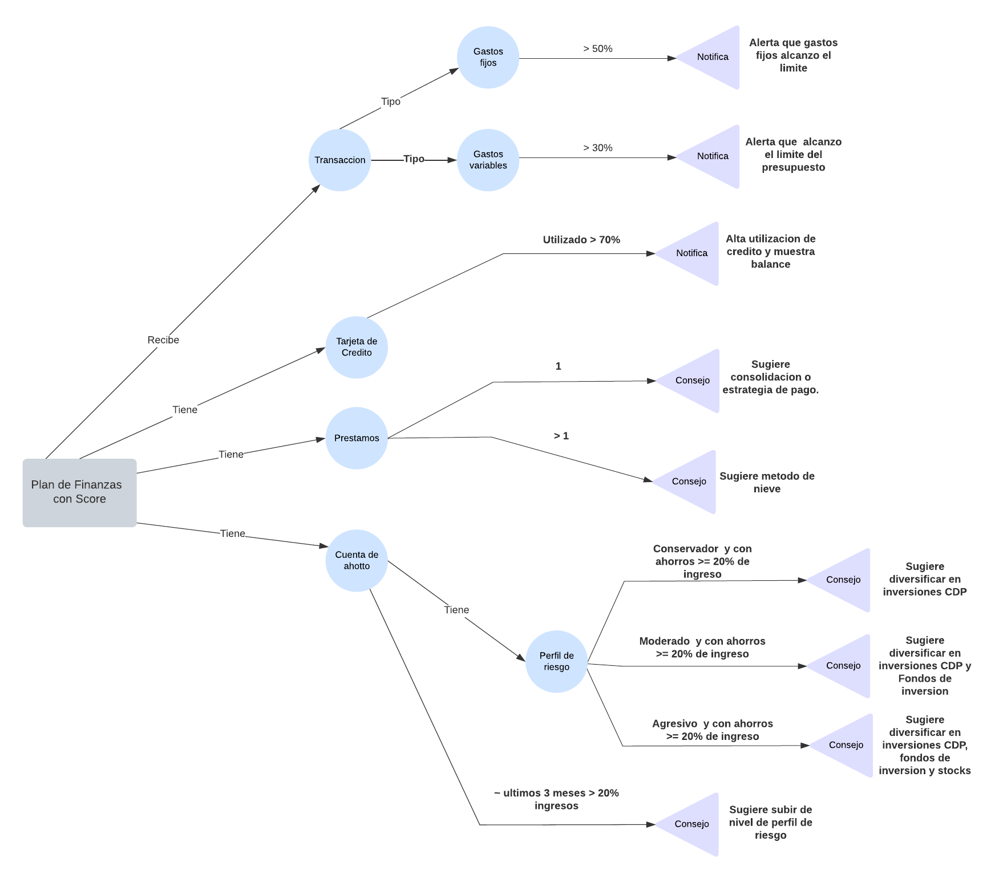

# 📊 Personal Intelligent Financial Advisor  
## Students  
- Alberto Espinoza González  
- Denis Andres Solano Monge  
- Luis Gabriel Masis Fernandez  
- Carlos Alfredo Carranza Hidalgo  

## Repository:  
- [Personal-Intelligent-Financial-Advisor](https://github.com/ccarranzah/Asesor-Financiero-Inteligente-Personal)  

## 📌 Description  
The **Personal Intelligent Financial Advisor** is a knowledge-based system designed to help users efficiently manage their **income, expenses, debts, and investments**. It uses financial rules, case-based learning, and optimization algorithms to provide **personalized recommendations** and real-time alerts.  

## 🎯 Objective  
Provide intelligent financial advice based on the user's **personal economic situation**, helping to improve financial planning and decision-making.  

## ⚙️ System Components  
- **Rule Base**: Defines strategies for managing income, expenses, debts, and investments.  
- **Fact Base**: Stores user financial data, including transaction history.  
- **Inference Engine**: Applies rules and financial logic to generate recommendations.  

## 🛠️ Technologies Used  
- **Backend**: `.NET Core 9` with **C#**  
- **Database**: `SQLite`  
- **Inference Logic**: `NRules (First Order Logic - FOL)`  

## 🚀 Key Features  
✅ Automatic analysis of income and expenses  
✅ Personalized recommendations for saving and investing  
✅ Real-time financial alerts  
✅ Debt payment optimization  
✅ Financial data visualization  

## 📂 Installation and Execution  
If you have no programming experience, follow these detailed steps to install and run the project on your computer or you can skip to Step 3 to run from a container.

### 🖥️ Prerequisites  
Before starting, ensure you have the following installed on your computer:  
1. [**Git**](https://git-scm.com/downloads): Required to download the repository code.  
2. [**.NET SDK**](https://dotnet.microsoft.com/en-us/download): Required to run the application.  

To verify installation:  
- Open the terminal or command prompt:  
   - **Windows**: Press `Win + R`, type `cmd`, and press `Enter`.  
   - **Mac/Linux**: Open the terminal (`Terminal` on Mac or `Ctrl + Alt + T` on Linux).  
- Type the following commands and press `Enter`:  
   ```bash  
   git --version  
   dotnet --version  
   ```  
   - If you see a version number, they are installed.  

### 📥 Step 1: Download the Project  
1. Open the terminal or command prompt.  
2. Type the following command to download the repository code:  
    ```bash  
    git clone https://github.com/ccarranzah/Asesor-Financiero-Inteligente-Personal.git  
    ```  
3. Navigate to the project folder:  
    ```bash  
    cd .\Asesor-Financiero-Inteligente-Personal\  
    ```  

### ⚙️ Step 2: Run the Project with Docker  
If you have Docker installed, you can run the project without installing .NET SDK. Simply use the following command:  
```bash  
docker-compose up  
```  
This will download the necessary images, build the container, and run the system automatically, mounting a volume to persist the database and creating the port binding. Open your browser at http://localhost:8080.  

### ▶️ Alternative: Run the Project Manually  
If you prefer not to use Docker, ensure you have .NET SDK installed and follow these steps:  

1. Navigate to the application folder:  
    ```bash  
    cd .\src\SmartFinanceAI\SmartFinanceAI.Blazor  
    ```  
2. Install the required dependencies by running:  
    ```bash  
    dotnet restore  
    ```  
3. Start the system with:  
    ```bash  
    dotnet run  
    ```  

After a few seconds, the system will be running and display information in the console.  

### 🔄 Step 4: Interact with the System  
- Depending on the configuration, you can view results directly in the terminal or in a web interface if the project includes one.  
- Follow the on-screen instructions to test its functionalities.  

## 🛠️ Development and Collaboration  
If you want to contribute, check the **[CONTRIBUTING](CONTRIBUTING.md)** file for development guidelines. Any suggestions or improvements are welcome 🚀.  

## 📄 License  
This project is under the MIT License. See the [LICENSE](LICENSE) file for more details.  

## Knowledge Diagram  

  

## 📌 Use Cases and Examples  

### Use Case 1: Threshold Notification  

#### Objective  
Notify the user when, upon registering a transaction, they are close to exceeding (or have exceeded) the threshold assigned to each segment of the 50/30/20 rule:  
- 50% for essential expenses (rent, utilities, insurance, etc.),  
- 30% for variable expenses (entertainment, leisure, shopping, etc.),  
- 20% for savings/investment.  

The system monitors entered transactions and determines if the new accumulated amount in any category is near its limit or exceeds it.  

#### Actors  
- **User (Main Actor)**:  
   - Registers their transactions (income, expenses).  
   - Can receive notifications or alerts.  
- **Intelligent Financial Advisor System**:  
   - Processes transactions in real-time.  
   - Determines if a category is near or has exceeded its 50/30/20 rule threshold.  
   - Sends the corresponding notification to the user.  

#### Description  
1. The user enters a new transaction (e.g., an expense in the variable expenses category).  
2. The system accumulates the expense in the corresponding category (in this case, "lifestyle" or "variable").  
3. Based on the total sum of each category and the established monthly income, the system calculates the current percentage.  
4. If it detects that the category is reaching or about to exceed the percentage limit (50% for needs, 30% for lifestyle, or 20% for savings/investment), an alert is triggered.  
5. The user receives a notification (email, SMS, push notification, etc.) indicating the status and corresponding recommendation.  

#### Preconditions  
- The user has already configured their monthly income and expense categories, assigning them according to the 50/30/20 rule.  
- The system maintains a detailed record of categorized transactions (needs, lifestyle, savings/investment).  
- The user has access to the system to register their transactions (app, web, etc.).  

#### Main Flow  

**Transaction Entry**  
1. The user enters a new transaction, indicating:  
    - Amount  
    - Category (e.g., needs, lifestyle, or savings)  
    - Date and description, if applicable.  

**Balance Update and Percentage Calculation**  
1. The system takes the new transaction and updates the total accumulated in the corresponding category.  
2. Recalculates the percentage spent in each segment (needs, lifestyle, and savings) relative to the monthly income.  

**Threshold Verification**  
1. The system compares the current percentages with the limits established by the 50/30/20 rule.  
    - **Needs**: Has reached or is about to reach 50% of income allocated to this category.  
    - **Lifestyle**: Has reached or is about to reach 30% of income.  
    - **Savings**: Verifies if it maintains or exceeds 20% (or if it is not being met).  

**Alert Generation**  
1. If any limits are exceeded or are close to being exceeded (e.g., surpassing 90% of the 30% for lifestyle), the system generates an alert or recommendation notification.  
2. The notification includes the percentage reached and possible advice to avoid exceeding the limit or to adjust to the savings/investment goal.  

**User Notification**  
1. The system sends the alert through the configured channel (email, mobile app, SMS, etc.).  
2. The user can view the details and decide to take action (cut expenses, transfer budget from another category, etc.).  

**End of Use Case**  
The process ends once the system has notified the user and the transaction is recorded.  

---  

For additional use cases and examples, refer to the original documentation.  
